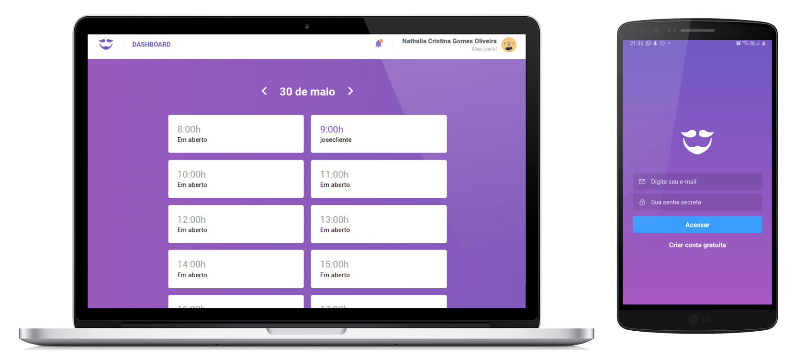

<p align="center">
       
</p>

<h1 align="center">
    GoBarber API
</h1>

<h3 align="center">
Plataforma de agendamento e gerenciamento para barbearias
</h3>

<p align="center">
  <a href="#rocket-sobre-o-projeto">Sobre o projeto</a> | <a href="#computer-tecnologias">Tecnologias</a> | <a href="#books-guia-de-instalação-e-execução">Guia de instalação e execução</a> | <a href="#pencil-como-contribuir">Como contribuir</a> | <a href="#page_with_curl-licença">Licença</a>
</p>

## Layout



## :rocket: Sobre o projeto

<p>Esta é uma plataforma completa onde o cliente pode visualizar a agenda de barbeiros e agendar um horário, 
e para barbeiros, permite gerenciar os horários marcados.</p> 

<p>Este é o repositório da API do projeto.</p>
<ul>
  <li>Para a versão web, <a href="https://github.com/nathaliacristina20/gobarber-web">clique aqui</a>.</li>
  <li>Para a versão mobile, <a href="https://github.com/nathaliacristina20/gobarber-mobile">aqui</a>.</li>
</ul>

## :computer: Tecnologias
    
- [Node.js](https://nodejs.org/en/)
- [Bee Queue](https://github.com/bee-queue/bee-queue)
- [Sequelize](https://sequelize.org/)
- [Youch](https://github.com/poppinss/youch)
- [Yup](https://github.com/jquense/yup)
- [Nodemon](https://nodemon.io/) 
- [Mongoose](https://mongoosejs.com/)
- [Express](https://expressjs.com/pt-br/)
- [ESLint-Airbnb](https://eslint.org/), [Prettier](https://prettier.io/) e [EditorConfig](https://editorconfig.org/)
- [Multer](https://github.com/expressjs/multer)
- [Datefns](https://date-fns.org/)
- [Dotenv](https://github.com/motdotla/dotenv)
- [Bcrypt.js](https://github.com/dcodeIO/bcrypt.js/)
- [Jsonwebtoken](https://github.com/auth0/node-jsonwebtoken)
- [Handlebars](https://handlebarsjs.com/)
- [Nodemailer](https://nodemailer.com/about/)
- [Cors](https://github.com/expressjs/cors)
- [Express Brute](https://github.com/AdamPflug/express-brute)
- [Helmet](https://github.com/helmetjs/helmet)
- [Rate Limit](https://github.com/iugu/rate-limiting)
- [Ioredis](https://github.com/luin/ioredis)

## :books: Guia de instalação e execução

### Pré-requisitos

- [Git](https://git-scm.com/)
- [Node.js](https://nodejs.org/en/) v10.20 ou maior
- [Yarn](https://yarnpkg.com/)
- Uma instância de [PostgreSQL](https://www.postgresql.org/), [Mongodb](https://www.mongodb.com/) e [Redis](https://redis.io/) **

** Ou [Docker](https://www.docker.com/) 

### Como executar

<i>Antes de executar estes passos, você precisa ter uma instância dos bancos listados acima ou um Docker com as imagens e os databases e schemas criados.</i>

- Clone o repositório ```git clone https://github.com/nathaliacristina20/gobarber-server.git```
- Vá até o diretório ```cd gobarber-server```
- Execute ```yarn``` para instalar as dependências
- Copie o arquivo .env.example executando ```cp .env.example .env``` para linux ou mac e ```copy .env.example .env``` para windows
- Abra o arquivo .env e preencha com suas variáveis de ambiente
- Execute ```yarn sequelize db:migrate``` para rodar as migrations 
- Execute ```yarn dev``` para rodar o servidor
- Em outro terminal, execute ```yarn queue``` para executar a fila

Para debugar, utilize o comando ```yarn dev:debug```

Você pode realizar requisições REST através do Insomnia

[](https://insomnia.rest/run/?label=GoBarber&uri=https%3A%2F%2Fraw.githubusercontent.com%2Fnathaliacristina20%2Fgostack-gobarber-server%2Fmaster%2Finsomnia.json)

## :pencil: Como contribuir

<b>Faça um fork deste repositório</b>

```bash
# Clone o seu fork
$ git clone url-do-seu-fork && cd gostack-gobarber-server

# Crie uma branch com sua feature ou correção de bugs
$ git checkout -b minha-branch

# Faça o commit das suas alterações
$ git commit -m 'feature/bugfix: minhas alterações'

# Faça o push para a sua branch
$ git push origin minha-branch
```

Depois que o merge da sua pull request for feito, você pode deletar a sua branch.

## :page_with_curl: Licença

Esse projeto está sob a licença MIT. Veja o arquivo <a href="https://github.com/nathaliacristina20/be-the-hero/blob/master/LICENSE">LICENSE</a> para mais detalhes.

<hr />
<p>by Nathalia Cristina :wave: <a href="https://linktr.ee/nathaliacristina20">Get in touch!</a></p>
